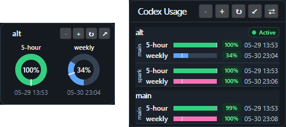

> [!WARNING]
> This repository was mostly or entirely created through vibe coding: the code, documentation, and project structure were produced primarily by AI agents, with most or all work performed through the Codex app. Any review, cleanup, or validation may also have been performed by AI agents rather than by a human.
>
> The repository owner uses the resulting project, binaries, application, or other outputs personally and is sharing it because it works for their own use case. That does not mean the code is production-ready, secure, reliable, portable, or appropriate for your environment.
>
> Do not use, build, run, deploy, or copy code from this repository without a thorough independent review and without accepting the associated risks. The repository owner does not accept responsibility or liability for any damage, data loss, security issue, malfunction, or other harm caused by using this repository or anything derived from it.

# Codex Widget

Codex Widget is a .NET desktop and web status viewer for Codex profile and usage
state. It reads Codex profile data managed by
[codex-profiles](https://github.com/midhunmonachan/codex-profiles)/Codex from a
local home directory, summarizes account status, and renders it either as a small
desktop widget or as a browser UI with JSON endpoints.



## Status

This repository is in active development. The current codebase includes:

- an Avalonia desktop widget with tray menu, placement/settings persistence, and
  profile/usage refresh;
- desktop minimal and compact widget views with theme, scale, compact layout,
  always-on-top, refresh-period, work-schedule, and quota-threshold settings;
- an ASP.NET Core web host with static frontend, theme toggle, health checks,
  status API, and manual refresh API;
- shared runtime, profile, usage, status, core, and presentation libraries;
- unit and integration-style tests for the shared logic, desktop shell, and web
  host contracts.

Known project goals are to keep status collection portable outside either UI,
avoid storing secrets in this repo, preserve explicit "unavailable" states, and
support both a local desktop widget and a deployable trusted-LAN web view.

## Stack

- .NET 10 / C#
- Avalonia 12 for the desktop app
- ASP.NET Core minimal APIs plus static HTML/CSS/JS for the web app
- Docker/Compose for containerized web hosting
- xUnit tests

## Data Source

The apps expect a Codex home layout containing `.codex/auth.json`,
`.codex/config.toml`, and `.codex/profiles/`. By default they use the current OS
user home directory. For alternate data, set the home directory path, not the
`.codex` directory itself.

Never commit real auth files, access tokens, refresh tokens, API keys, or local
`.codex` data.

## Usage Model

The widget reads profile identity and usage data, then projects it into explicit
available or unavailable states. It shows active profile state, subscription
tier, main and spark usage buckets when present, and 5-hour plus weekly usage
windows with quota-left, time-left, and reset-time values.

Weekly time-left is based on a configurable weekly work schedule. Defaults are
07:00-17:00 Monday-Friday and 20:00-23:00 Saturday-Sunday in the
Europe/Warsaw time zone. Quota colors use configurable gate thresholds:
red below 70%, yellow below 90%, blue above 110%, and pink above 130% by
default.

## Build And Test

Prerequisite: .NET 10 SDK.

```bash
dotnet restore CodexWidget.slnx
dotnet build CodexWidget.slnx
dotnet test CodexWidget.slnx
```

## Helper Scripts

The scripts in `scripts/` are optional wrappers around common build and
validation commands. They resolve paths from the repository root and can be run
from any working directory. Packaging requires either `zip` or `bsdtar`.

Publish and package the desktop app for Windows:

```bash
scripts/publish-win-x64-package.sh
```

Common options:

```bash
scripts/publish-win-x64-package.sh \
  --configuration Release \
  --runtime win-x64 \
  --artifact-set desktop \
  --self-contained true
```

Outputs are written to `artifacts/publish/<artifact-set>/<runtime>/` and
`artifacts/packages/<artifact-set>/`.

To create a smaller framework-dependent Windows desktop package instead, pass
`--self-contained false`. The target machine then needs the matching .NET
desktop runtime installed.

Publish and package the web app:

```bash
scripts/publish-web.sh
```

Common options:

```bash
scripts/publish-web.sh \
  --configuration Release \
  --artifact-set web
```

Outputs are written to `artifacts/publish/<artifact-set>/web/` and
`artifacts/packages/<artifact-set>/`.

Run a loopback smoke test for the web app:

```bash
scripts/validate-web-loopback.sh
```

The loopback helper starts `CodexWidget.Web`, waits for `/health` and
`/health/status`, then stops the process. Use `--port` or `--base-url` to avoid
port conflicts.

GitHub release packaging produces tag-suffixed assets:

- `codex-widget-win-x64-self-contained-vX.Y.Z.zip` - Windows desktop app with
  runtime included.
- `codex-widget-win-x64-vX.Y.Z.zip` - smaller framework-dependent Windows
  desktop app.
- `codex-widget-web-vX.Y.Z.zip` - framework-dependent web app publish output.

## Desktop Widget

### Install From A Package

If a GitHub Release provides a Windows desktop package, download the
`codex-widget-win-x64-self-contained-vX.Y.Z.zip` asset, extract it to a local
folder, and run:

```powershell
.\CodexWidget.App.exe
```

The self-contained package includes the .NET runtime needed by the desktop app.
The smaller `codex-widget-win-x64-vX.Y.Z.zip` asset is framework-dependent and
requires the .NET desktop runtime on the target machine.

### Controls And Settings

The desktop app runs as a frameless tray widget. Closing the widget hides it;
use the tray menu to show settings, reset position, toggle always-on-top, or
quit. Clicking the tray icon shows the widget and requests a stale-open refresh
when the scheduler is running.

The visible widget modes are minimal and compact. The compact view can switch
between vertical and horizontal account layouts, and both visible modes expose
inline scale and refresh controls. Settings persist selected view, compact
layout, theme, widget scale, always-on-top, refresh period, weekly work
schedule, quota thresholds, and window placement.

### Run From Source

Run from source:

```bash
dotnet run --project src/CodexWidget.App/CodexWidget.App.csproj
```

Run with an alternate Codex home:

```bash
CODEX_PROFILES_HOME=/path/to/home-containing-dot-codex \
  dotnet run --project src/CodexWidget.App/CodexWidget.App.csproj
```

Publish a Windows build:

```bash
scripts/publish-win-x64-package.sh
```

Extract or copy the generated package from
`artifacts/packages/desktop/codex-widget-win-x64-self-contained.zip`, then run
`CodexWidget.App.exe`. The unpacked publish output is also available at
`artifacts/publish/desktop/win-x64/`.

## Web App

### Docker

Clone the repository and enter the checkout:

```bash
git clone <repo-url>
cd codex-widget
```

Create a local Compose environment file:

```bash
cp docker-compose.env.example .env
```

Edit `.env` so `CODEX_WIDGET_DATA_DIR` points to the host directory that
contains `.codex/`. Set it to the home directory that contains `.codex`, not to
the `.codex` directory itself.

Build and start the container:

```bash
docker compose up -d --build
```

Check container status and health:

```bash
docker compose ps
curl -fsS http://127.0.0.1:8787/health
curl -fsS http://127.0.0.1:8787/health/status
```

Open `http://127.0.0.1:8787/`. Health checks are available at `/health` and
`/health/status`.

### Non-Docker

Run locally from source with the .NET SDK:

```bash
CodexWidgetWeb__CodexProfilesHome=/path/to/home-containing-dot-codex \
  dotnet run --project src/CodexWidget.Web/CodexWidget.Web.csproj
```

Or publish the web app and run the published output:

```bash
scripts/publish-web.sh
cd artifacts/publish/web/web
CodexWidgetWeb__CodexProfilesHome=/path/to/home-containing-dot-codex \
  ASPNETCORE_URLS=http://127.0.0.1:8787 \
  dotnet CodexWidget.Web.dll
```

If a GitHub Release provides a web package, download the
`codex-widget-web-vX.Y.Z.zip` asset, extract it, and run the same
`dotnet CodexWidget.Web.dll` command from the extracted directory. This package
is framework-dependent, so the target machine needs the .NET 10 ASP.NET Core
runtime installed.

By default the web host binds to `http://127.0.0.1:8787`. To bind elsewhere, set
`ASPNETCORE_URLS`; non-loopback bindings also require
`CodexWidgetWeb__AllowLanBinding=true`.

### Configuration

The web host uses the `CodexWidgetWeb` configuration section. Environment
variables use double underscores, for example
`CodexWidgetWeb__CodexProfilesHome=/path/to/home-containing-dot-codex`.

Common options:

- `ASPNETCORE_URLS` or `CodexWidgetWeb__BindUrls__0` - bind URL; defaults to
  `http://127.0.0.1:8787`.
- `CodexWidgetWeb__AllowLanBinding` - required for non-loopback bind URLs.
- `CodexWidgetWeb__CodexProfilesHome` - home directory containing `.codex/`.
- `CodexWidgetWeb__EnableScheduler` - starts scheduled background refreshes
  when true.
- `CodexWidgetWeb__ServeStaticFiles` - serves the browser UI when true.
- `CodexWidgetWeb__PollingIntervalSeconds` - reported by
  `/api/status/frontend-options`.
- `CodexWidgetWeb__EnableCors` and
  `CodexWidgetWeb__AllowedCorsOrigins__0` - enable CORS for explicit origins
  only; wildcard origins are rejected.
- `CodexWidgetWeb__WorkSchedule__Monday__0__Start` and
  `CodexWidgetWeb__WorkSchedule__Monday__0__End` - override work windows used
  for weekly time-left calculations.
- `CodexWidgetWeb__QuotaThresholds__RedBelowPercent`,
  `__YellowBelowPercent`, `__BlueAbovePercent`, and `__PinkAbovePercent` -
  override quota color gates.

Useful endpoints:

- `/` - browser UI
- `/api/status/frontend-options` - safe frontend options
- `/api/status/presentation` - redacted presentation model
- `/api/status/snapshot` - redacted status snapshot
- `/api/status/refresh` - refresh metadata (`GET`) or manual refresh (`POST`)

`POST /api/status/refresh` accepts an optional JSON body with `scope` set to
`full`, `usageOnly`, or `profileOnly`; an empty body defaults to `full`.
